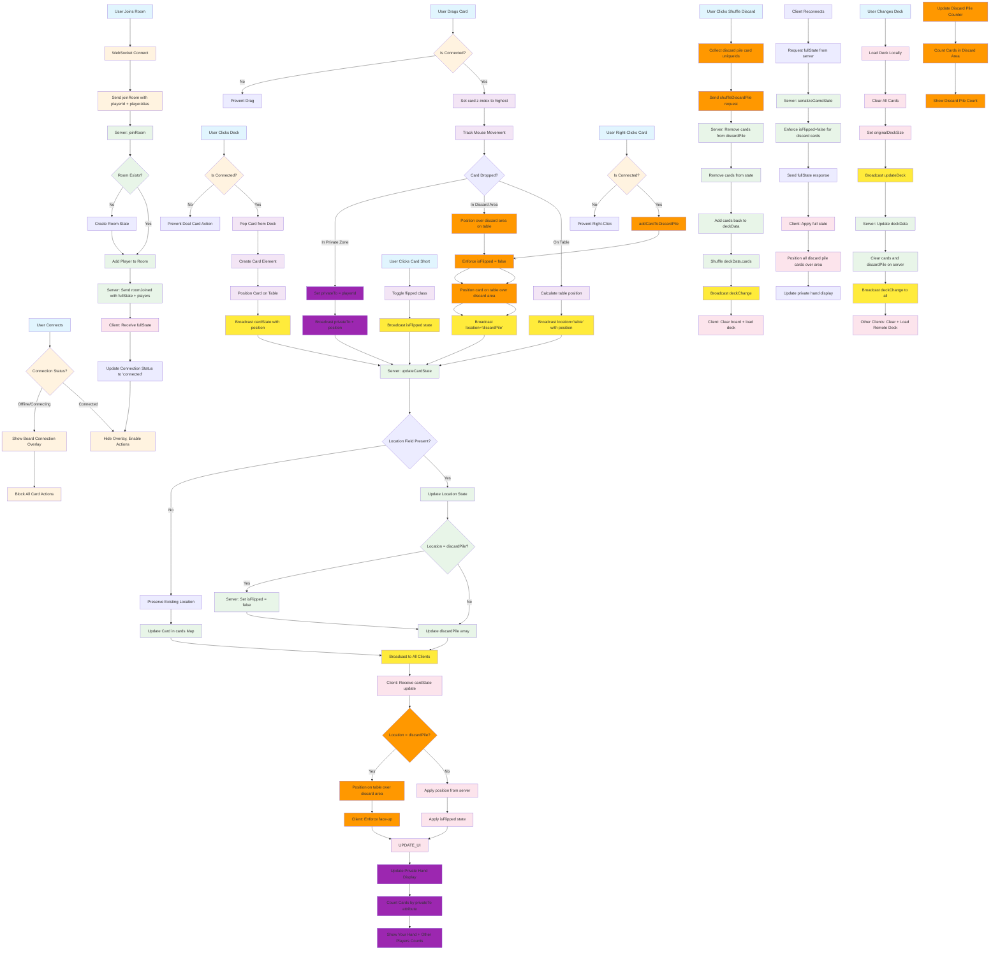

# Card Game Event State Management & UI Updates Flow

## Key Features:

### 🔌 **Connection Management & Action Blocking**
- **Connection Status Overlay**: Shows on-board overlay when offline/connecting, hides when connected
- **Action Prevention**: All card actions (deal, drag, right-click, flip) check connection status first
- **Visual Feedback**: Overlay covers entire board (including deck and private zone) with status indicator
- **Z-Index Hierarchy**: Menu (z-index: 10000) > Menu Toggle (z-index: 10001) > Overlay (z-index: 2000) > Cards

### 🗑️ **Discard Pile System (Area-Based)**
- **Area-Based Detection**: Cards are positioned on `card-table` over the `discard-pile-area` (not in a container)
- **Face-Up Enforcement**: Both server and client enforce `isFlipped=false` for discard pile cards
- **Location Property**: Cards use `location='discardPile'` vs `location='table'` to track state
- **No Reparenting**: Cards remain on `card-table` but positioned over discard area
- **Perfect Stacking**: No offsets - cards stack directly on top of each other

### 📡 **Server-Authoritative State**
- **Location Preservation**: Server preserves existing `location` if not explicitly provided in updates
- **State Reconciliation**: Server maintains `discardPile` array of uniqueIds and `cards` Map
- **Face-Up Enforcement**: Server enforces `isFlipped=false` when `location='discardPile'` is set
- **Full State Sync**: `serializeGameState` enforces face-up for all discard pile cards before sending

### 🎯 **Card State Updates**
- **Explicit Location**: All client updates include `location` property (discardPile or table)
- **Top-Left Coordinates**: Positions sent as top-left relative to table (prevents post-drop drift)
- **Z-Index Management**: Dragged cards always get highest z-index (10000+)
- **Private Zone Detection**: Cards dropped in private zone get `privateTo` attribute set

### 🔄 **Event Flow Patterns**
1. **Connection**: User Action → Connection Check → Action Allowed/Blocked → Update → Broadcast → Server Processing → Broadcast to All → UI Update
2. **Discard**: Drop in Area → Position Over Area → Enforce Face-Up → Broadcast `location='discardPile'` → Server Updates State → Broadcast to All
3. **Drag Out**: Drag from Discard → Calculate Position → Broadcast `location='table'` → Server Removes from discardPile → Broadcast to All
4. **Right-Click**: Right-Click Card → `addCardToDiscardPile` → Same flow as drag-drop discard

### 🎨 **UI State Management**
- **Private Hand Display**: Counts cards by `privateTo` attribute from DOM
- **Discard Pile Counter**: Counts cards whose center lies within `discard-pile-area` bounds
- **Connection Status**: Displays in both menu and on-board overlay
- **Player Aliases**: Uses aliases for display, playerId for state tracking

### ✅ **Key Improvements**
- **Area-Based Discard**: No container reparenting - cards stay on table with absolute positioning
- **Connection Blocking**: Prevents state loss by blocking actions when disconnected
- **Location Tracking**: Explicit `location` property ensures accurate state synchronization
- **Face-Up Enforcement**: Consistent enforcement at client broadcast, server update, and state serialization
- **Z-Index Management**: Dragged cards always visible above all other elements
- **Position Accuracy**: Top-left coordinates prevent visual drift on drop
