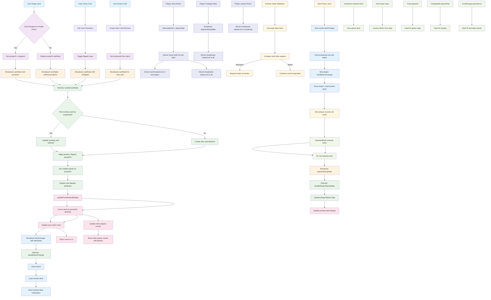

# Card Game Event State Management & UI Updates Flow

## Key Features:

### 🎯 **Single Source of Truth**
- All card state stored in `data-*` attributes on DOM elements
- No redundant data structures (removed `privateHands` Map)
- State derived directly from DOM queries

### 🔄 **Unified Event Flow**
1. **User Action** → **Local State Update** → **Broadcast** → **Remote Processing** → **UI Update**
2. **Single Message Type**: `deckChange` handles both deck changes and new player sync
3. **Consistent State**: All players see the same card states

### 🎨 **UI Updates**
- **Private Hand Display**: Counts cards by `privateTo` attribute
- **Visibility**: Cards hidden based on `privateTo` field
- **Real-time**: Updates triggered by every card state change
- **Player Names**: Shows player aliases instead of IDs in UI

### 🔒 **Private Hand Logic**
- **Local**: Set `privateTo = playerId` when dropped in private zone
- **Remote**: Hide card if `privateTo !== currentPlayerId`
- **Display**: Count cards where `privateTo === currentPlayerId`

### 👥 **Player Identity System**
- **Fixed playerId**: Unique identifier for game state (never changes)
- **Changeable playerAlias**: Display name that can be updated anytime
- **Game State Integrity**: All cards, private hands use fixed `playerId`
- **Display Names**: UI shows `playerAlias` for better user experience
- **localStorage**: Both ID and alias persisted between sessions

### 🔄 **Automatic Player List Management**
- **Player Joins**: Server automatically sends player list to new player
- **Alias Changes**: Server broadcasts updated player list to all players
- **Player Leaves**: Server sends updated list to remaining players
- **No Requests**: Eliminated `requestPlayerList` - lists sent automatically
- **Real-time Sync**: All players always have current player information

### 🃏 **Deck Architecture**
- **Base Deck Class**: Handles custom decks from data
- **StandardDeck**: Extends Deck for 52-card playing deck
- **VirusDeck**: Extends Deck for virus game deck
- **Common Methods**: All deck types share shuffle, deal, exportToJSON, etc.

### 🔄 **Deck Synchronization**
- **Host Changes Deck**: Broadcasts `deckChange` with `deckData`
- **New Player Joins**: Host sends `deckChange` to sync them
- **Remote Processing**: Clear board → Load remote deck → Show notification
- **Perfect Sync**: All players have identical deck state

### ✅ **No Redundancy**
- Removed `privateHands` Map
- Removed `addCardToPrivateHand`/`removeCardFromPrivateHand` functions
- Removed `privateHandUpdate` messages
- Removed `syncDeckData` (consolidated with `deckChange`)
- Removed `requestPlayerList` (automatic player list sending)
- Single `updatePrivateHandDisplay()` method handles all counting
- Single `deckChange` message handles all deck synchronization
- Automatic player list management eliminates manual requests
